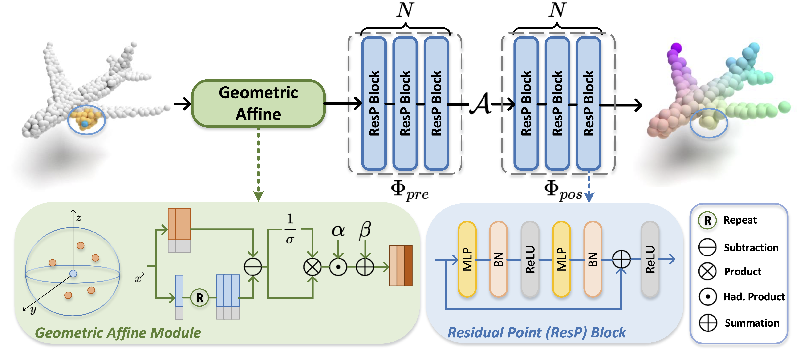

# Rethinking Network Design and Local Geometry in Point Cloud: A Simple Residual MLP Framework （ICLR 2022）


[](https://paperswithcode.com/sota/3d-point-cloud-classification-on-modelnet40?p=rethinking-network-design-and-local-geometry-1)
[](https://paperswithcode.com/sota/3d-point-cloud-classification-on-scanobjectnn?p=rethinking-network-design-and-local-geometry-1)


[](https://github.com/ma-xu/pointMLP-pytorch)


<div align="left">
    <a></a>
    <a></a>
    <a></a>
</div>

 [open review](https://openreview.net/forum?id=3Pbra-_u76D) | [arXiv](https://arxiv.org/abs/2202.07123) | Primary contact: [Xu Ma](mailto:ma.xu1@northeastern.edu)

<div align="center">
  
</div>

Overview of one stage in PointMLP. Given an input point cloud, PointMLP progressively extract local features using residual point MLP blocks. In each stage, we first transform local point using a geometric affine module, then local points are are extracted before and after aggregation respectively. By repeating multiple stages, PointMLP progressively enlarge the receptive field and model entire point cloud geometric information.


## BibTeX

    @inproceedings{
        ma2022rethinking,
        title={Rethinking Network Design and Local Geometry in Point Cloud: A Simple Residual {MLP} Framework},
        author={Xu Ma and Can Qin and Haoxuan You and Haoxi Ran and Yun Fu},
        booktitle={International Conference on Learning Representations},
        year={2022},
        url={https://openreview.net/forum?id=3Pbra-_u76D}
    }

## Model Zoo
- The codes/models/logs for submission version (without bug fixed) can be found here [commit:d2b8dbaa](http://github.com/13952522076/pointMLP-pytorch/tree/d2b8dbaa06eb6176b222dcf2ad248f8438582026).

- On ModelNet40, fixed pointMLP achieves a result of **91.5% mAcc** and **94.1% OA** without voting, logs and pretrained models can be found [[here]](https://web.northeastern.edu/smilelab/xuma/pointMLP/checkpoints/fixstd/modelnet40/pointMLP-20220209053148-404/).
- On ScanObjectNN, fixed pointMLP achieves a result of **84.4% mAcc** and **86.1% OA** without voting, logs and pretrained models can be found [[here]](https://web.northeastern.edu/smilelab/xuma/pointMLP/checkpoints/fixstd/scanobjectnn/pointMLP-20220204021453/). Fixed pointMLP-elite achieves a result of **81.7% mAcc** and **84.1% OA** without voting, logs and pretrained models can be found [[here]](https://web.northeastern.edu/smilelab/xuma/pointMLP/checkpoints/fixstd/scanobjectnn/model313Elite-20220220015842-2956/).
- Stay tuned. More elite versions and voting results will be uploaded.


## News & Updates:

- [x] fix the uncomplete utils in partseg by Mar/10, caused by error uplaoded folder.
- [x] upload test code for ModelNet40
- [ ] project page
- [x] update std bug (unstable testing in previous version)
- [x] paper/codes release

:point_right::point_right::point_right:**NOTE:** The codes/models/logs for submission version (without bug fixed) can be found here [commit:d2b8dbaa](http://github.com/13952522076/pointMLP-pytorch/tree/d2b8dbaa06eb6176b222dcf2ad248f8438582026).

<details>
  <summary>:fast_forward: Questions on ModelNet40 classification reproduction</summary>
  The performance on ModelNet40 of almost all methods are not stable, see (https://github.com/CVMI-Lab/PAConv/issues/9#issuecomment-873371422).
  If you run the same codes for several times, you will get different results.
  Also, the randomness of ModelNet40 is our motivation to experiment on ScanObjectNN benchmark, and to report the mean/std results of several runs.

</details>


## Install

```bash
# step 1. clone this repo
git clone https://github.com/ma-xu/pointMLP-pytorch.git
cd pointMLP-pytorch

# step 2. create a conda virtual environment and activate it
conda env create
conda activate pointmlp
```

```bash
# Optional solution for step 2: install libs step by step
conda create -n pointmlp python=3.7 -y
conda activate pointmlp
conda install pytorch==1.10.1 torchvision==0.11.2 cudatoolkit=10.2 -c pytorch -y
pip install cycler einops h5py pyyaml==5.4.1 scikit-learn==0.24.2 scipy tqdm matplotlib==3.4.2
pip install pointnet2_ops_lib/.
```


## Useage

### Classification ModelNet40
**Train**: The dataset will be automatically downloaded, run following command to train.

By default, it will create a folder named "checkpoints/{modelName}-{msg}-{randomseed}", which includes args.txt, best_checkpoint.pth, last_checkpoint.pth, log.txt, out.txt.
```bash
cd classification_ModelNet40
# train pointMLP
python main.py --model pointMLP
# train pointMLP-elite
python main.py --model pointMLPElite
# please add other paramemters as you wish.
```


To conduct voting testing, run
```bash
# please modify the msg accrodingly
python voting.py --model pointMLP --msg demo
```


### Classification ScanObjectNN

The dataset will be automatically downloaded

- Train pointMLP/pointMLPElite 
```bash
cd classification_ScanObjectNN
# train pointMLP
python main.py --model pointMLP
# train pointMLP-elite
python main.py --model pointMLPElite
# please add other paramemters as you wish.
```
By default, it will create a fold named "checkpoints/{modelName}-{msg}-{randomseed}", which includes args.txt, best_checkpoint.pth, last_checkpoint.pth, log.txt, out.txt.


### Part segmentation

- Make data folder and download the dataset
```bash
cd part_segmentation
mkdir data
cd data
wget https://shapenet.cs.stanford.edu/media/shapenetcore_partanno_segmentation_benchmark_v0_normal.zip --no-check-certificate
unzip shapenetcore_partanno_segmentation_benchmark_v0_normal.zip
```

- Train pointMLP
```bash
# train pointMLP
python main.py --model pointMLP
# please add other paramemters as you wish.
```


## Acknowledgment

Our implementation is mainly based on the following codebases. We gratefully thank the authors for their wonderful works.

[CurveNet](https://github.com/tiangexiang/CurveNet),
[PAConv](https://github.com/CVMI-Lab/PAConv),
[GDANet](https://github.com/mutianxu/GDANet),
[Pointnet2_PyTorch](https://github.com/erikwijmans/Pointnet2_PyTorch)

# My experiments: DUAL NET

```yaml
dual_net: True
num_points_low: 256
num_points_high: 2048
num_channel: 16
neighbours_low: 12
neighbours_high: 24
```
 conda init bash 
 conda activate sneha
cd project_dir/point_mlp_research/classification_ModelNet40/ 
python main.py 


New experiments:

| Experiment              | Results | Script                                                                                                                                                                                                                        |
|-------------------------|---------|-------------------------------------------------------------------------------------------------------------------------------------------------------------------------------------------------------------------------------|
| PointMLP/ points = 64   | 90.924  | --model pointMLP --neighbours_low 8 --num_points_low 64 --workers 16 --msg points_64 --seed 0                                                                                                                                 |
| PointMLP/ points = 128  | 91.775  | --model pointMLP --neighbours_low 16 --num_points_low 128 --workers 16 --msg points_128 --seed 0                                                                                                                              |
| PointMLP/ points = 256  | 92.139  | --model pointMLP --num_points_low 256 --workers 16 --msg points_256 --seed 0                                                                                                                                                  |
| PointMLP/ points = 512  | 92.666  | --model pointMLP --num_points_low 512 --workers 16 --msg points_512 --seed 0                                                                                                                                                  |
| PointMLP/ points = 1024 | 92.909  | --model pointMLP --num_points_low 1024 --workers 16 --msg points_1024 --seed 0                                                                                                                                                |
| PointMLP/ points = 2048 |         | --model pointMLP --num_points_low 2048 --workers 16 --msg points_2048 --seed 0                                                                                                                                                |
| DualNet 64/128          | 91.532  | --msg dual_concat_64-128 --num_points_low 64 --num_points_high 128 --neighbours_high 16 --neighbours_low 8 --num_channel 16 --model pointMLP --workers 16 --dual_net True  --seed 0                                           |
| DualNet 64/256          | 91.572  | --msg dual_concat_64-256 --num_points_low 64 --num_points_high 256 --neighbours_high 32 --neighbours_low 8 --num_channel 16 --model pointMLP --workers 16 --dual_net True  --seed 0                                           |
| DualNet 64/512          | 92.707  | --msg dual_concat_64-512 --num_points_low 64 --num_points_high 512 --neighbours_high 32 --neighbours_low 8 --num_channel 16 --model pointMLP --workers 16 --dual_net True  --seed 0                                           |
| DualNet 64/1024         | 92.626  | --msg dual_concat_64-1024 --num_points_low 64 --num_points_high 1024 --neighbours_high 32 --neighbours_low 8 --num_channel 16 --model pointMLP --workers 16 --dual_net True  --seed 0                                         |
| DualNet 64/2048         | 92.139  | --msg dual_concat_64-2048 --num_points_low 64 --num_points_high 2048 --neighbours_high 32 --neighbours_low 8 --num_channel 16 --model pointMLP --workers 16 --dual_net True  --seed 0                                         |
| DualNet 128/256         | 92.058  | --msg dual_concat_128-256 --num_points_low 128 --num_points_high 256 --neighbours_high 32 --neighbours_low 16 --num_channel 16 --model pointMLP --workers 16 --dual_net True  --seed 0                                        |
| DualNet 128/512         | 92.464  | --msg dual_concat_128-512 --num_points_low 128 --num_points_high 512 --neighbours_high 32 --neighbours_low 16 --num_channel 16 --model pointMLP --workers 16 --dual_net True  --seed 0                                        |
| DualNet 128/1024        | 93.031  | --msg dual_concat_128-1024 --num_points_low 128 --num_points_high 1024 --neighbours_high 32 --neighbours_low 16 --num_channel 16 --model pointMLP --workers 16 --dual_net True  --seed 0                                      |
| DualNet 128/2048        | 92.666  | --msg dual_concat_128-2048 --num_points_low 128 --num_points_high 2048 --neighbours_high 32 --neighbours_low 16 --num_channel 16 --model pointMLP --workers 16 --dual_net True  --seed 0                                      |
| DualNet 256/512         | 91.653  | --msg dual_concat_256-512 --num_points_low 256 --num_points_high 512 --neighbours_high 32 --neighbours_low 32 --num_channel 16 --model pointMLP --workers 16 --dual_net True  --seed 0                                        |
| DualNet 256/1024        | 92.464  | --msg dual_concat_256-1024 --num_points_low 256 --num_points_high 1024 --neighbours_high 32 --neighbours_low 32 --num_channel 16 --model pointMLP --workers 16 --dual_net True  --seed 0                                      |
| DualNet 256/2048        | 93.314  | --msg dual_concat_256-2048 --num_points_low 256 --num_points_high 2048 --neighbours_high 32 --neighbours_low 32 --num_channel 16 --model pointMLP --workers 16 --dual_net True  --seed 0                                      |
| DualNet 512/1024        | 91.734  | --msg dual_concat_512-1024 --num_points_low 512 --num_points_high 1024 --neighbours_high 32 --neighbours_low 32 --num_channel 16 --model pointMLP --workers 16 --dual_net True  --seed 0                                      |
| DualNet 512/2048        | 93.233  | --msg dual_concat_512-2048 --num_points_low 512 --num_points_high 2048 --neighbours_high 32 --neighbours_low 32 --num_channel 16 --model pointMLP --workers 16 --dual_net True  --seed 0                                      |
| DualNet 1024/2048       | 92.747* | --msg dual_concat_1024-2048 --num_points_low 1024 --num_points_high 2048 --neighbours_high 32 --neighbours_low 32 --num_channel 16 --model pointMLP --workers 16 --dual_net True  --seed 0                                    |
| DualNet 64/128          | 90.883  | --last_layer_concat multiply --msg dual_multiply_64-128 --num_points_low 64 --num_points_high 128 --neighbours_high 16 --neighbours_low 8 --num_channel 16 --model pointMLP --workers 16 --dual_net True  --seed 0            |
| DualNet 64/256          | 91.613  | --last_layer_concat multiply --msg dual_multiply_64-256 --num_points_low 64 --num_points_high 256 --neighbours_high 32 --neighbours_low 8 --num_channel 16 --model pointMLP --workers 16 --dual_net True  --seed 0            |
| DualNet 64/512          | 92.342  | --last_layer_concat multiply --msg dual_multiply_64-512 --num_points_low 64 --num_points_high 512 --neighbours_high 32 --neighbours_low 8 --num_channel 16 --model pointMLP --workers 16 --dual_net True  --seed 0            |
| DualNet 64/1024         | 92.423  | --last_layer_concat multiply --msg dual_multiply_64-1024 --num_points_low 64 --num_points_high 1024 --neighbours_high 32 --neighbours_low 8 --num_channel 16 --model pointMLP --workers 16 --dual_net True  --seed 0          |
| DualNet 64/2048         | 93.071  | --last_layer_concat multiply --msg dual_multiply_64-2048 --num_points_low 64 --num_points_high 2048 --neighbours_high 32 --neighbours_low 8 --num_channel 16 --model pointMLP --workers 16 --dual_net True  --seed 0          |
| DualNet 128/256         | 91.532  | --last_layer_concat multiply --msg dual_multiply_128-256 --num_points_low 128 --num_points_high 256 --neighbours_high 32 --neighbours_low 16 --num_channel 16 --model pointMLP --workers 16 --dual_net True  --seed 0         |
| DualNet 128/512         | 92.626  | --last_layer_concat multiply --msg dual_multiply_128-512 --num_points_low 128 --num_points_high 512 --neighbours_high 32 --neighbours_low 16 --num_channel 16 --model pointMLP --workers 16 --dual_net True  --seed 0         |
| DualNet 128/1024        | 92.869  | --last_layer_concat multiply --msg dual_multiply_128-1024 --num_points_low 128 --num_points_high 1024 --neighbours_high 32 --neighbours_low 16 --num_channel 16 --model pointMLP --workers 16 --dual_net True  --seed 0       |
| DualNet 128/2048        | 92.747  | --last_layer_concat multiply --msg dual_multiply_128-2048 --num_points_low 128 --num_points_high 2048 --neighbours_high 32 --neighbours_low 16 --num_channel 16 --model pointMLP --workers 16 --dual_net True  --seed 0       |
| DualNet 256/512         | 91.248  | --last_layer_concat multiply --msg dual_multiply_256-512 --num_points_low 256 --num_points_high 512 --neighbours_high 32 --neighbours_low 32 --num_channel 16 --model pointMLP --workers 16 --dual_net True  --seed 0         |
| DualNet 256/1024        | 92.950  | --last_layer_concat multiply --msg dual_multiply_256-1024 --num_points_low 256 --num_points_high 1024 --neighbours_high 32 --neighbours_low 32 --num_channel 16 --model pointMLP --workers 16 --dual_net True  --seed 0       |
| DualNet 256/2048        | 91.977  | --last_layer_concat multiply --msg dual_multiply_256-2048 --num_points_low 256 --num_points_high 2048 --neighbours_high 32 --neighbours_low 32 --num_channel 16 --model pointMLP --workers 16 --dual_net True  --seed 0       |
| DualNet 512/1024        | 93.031  | --last_layer_concat multiply --msg dual_multiply_512-1024 --num_points_low 512 --num_points_high 1024 --neighbours_high 32 --neighbours_low 32 --num_channel 16 --model pointMLP --workers 16 --dual_net True  --seed 0       |
| DualNet 512/2048        | 92.585  | --last_layer_concat multiply --msg dual_multiply_512-2048 --num_points_low 512 --num_points_high 2048 --neighbours_high 32 --neighbours_low 32 --num_channel 16 --model pointMLP --workers 16 --dual_net True  --seed 0       |
| DualNet 1024/2048       | 93.112  | --last_layer_concat multiply --msg dual_multiply_1024-2048 --num_points_low 1024 --num_points_high 2048 --neighbours_high 32 --neighbours_low 32 --num_channel 16 --model pointMLP --workers 16 --dual_net True  --seed 0     |
| DualNet 64/128          | 91.005  | --last_layer_concat add --msg dual_add_64-128 --num_points_low 64 --num_points_high 128 --neighbours_high 16 --neighbours_low 8 --num_channel 16 --model pointMLP --workers 16 --dual_net True  --seed 0                      |
| DualNet 64/256          | 91.734  | --last_layer_concat add --msg dual_add_64-256 --num_points_low 64 --num_points_high 256 --neighbours_high 32 --neighbours_low 8 --num_channel 16 --model pointMLP --workers 16 --dual_net True  --seed 0                      |
| DualNet 64/512          | 92.423  | --last_layer_concat add --msg dual_add_64-512 --num_points_low 64 --num_points_high 512 --neighbours_high 32 --neighbours_low 8 --num_channel 16 --model pointMLP --workers 16 --dual_net True  --seed 0                      |
| DualNet 64/1024         | 92.869  | --last_layer_concat add --msg dual 56-2048 --num_points_low 256 --num_points_high 2048 --neighbours_high 32 --neighbours_low 32 --num_channel 16 --model pointMLP --workers 16 --dual_net True  --seed 0                      |
| DualNet 512/1024        | RUNNING | --last_layer_concat add --msg dual_add_512-1024 --num_points_low 512 --num_points_high 1024 --neighbours_high 32 --neighbours_low 32 --num_channel 16 --model pointMLP --workers 16 --dual_net True  --seed 0                 |
| DualNet 512/2048        | RUNNING | --last_layer_concat add --msg dual_add_512-2048 --num_points_low 512 --num_points_high 2048 --neighbours_high 32 --neighbours_low 32 --num_channel 16 --model pointMLP --workers 16 --dual_net True  --seed 0                 |
| DualNet 1024/2048       | RUNNING | --last_layer_concat add --msg dual_add_1024-2048 --num_points_low 1024 --num_points_high 2048 --neighbours_high 32 --neighbours_low 32 --num_channel 16 --model pointMLP --workers 16 --dual_net True  --seed 0               |
| DualNet 64/128          | RUNNING | --last_layer_concat none --msg dual_none_64-128 --num_points_low 64 --num_points_high 128 --neighbours_high 16 --neighbours_low 8 --num_channel 16 --model pointMLP --workers 16 --dual_net True  --seed 0                    |
| DualNet 64/256          | RUNNING | --last_layer_concat none --msg dual_none_64-256 --num_points_low 64 --num_points_high 256 --neighbours_high 32 --neighbours_low 8 --num_channel 16 --model pointMLP --workers 16 --dual_net True  --seed 0                    |
| DualNet 64/512          | RUNNING | --last_layer_concat none --msg dual_none_64-512 --num_points_low 64 --num_points_high 512 --neighbours_high 32 --neighbours_low 8 --num_channel 16 --model pointMLP --workers 16 --dual_net True  --seed 0                    |
| DualNet 64/1024         | RUNNING | --last_layer_concat none --msg dual_none_64-1024 --num_points_low 64 --num_points_high 1024 --neighbours_high 32 --neighbours_low 8 --num_channel 16 --model pointMLP --workers 16 --dual_net True  --seed 0                  |
| DualNet 64/2048         | RUNNING | --last_layer_concat none --msg dual_none_64-2048 --num_points_low 64 --num_points_high 2048 --neighbours_high 32 --neighbours_low 8 --num_channel 16 --model pointMLP --workers 16 --dual_net True  --seed 0                  |
| DualNet 128/256         |         | --last_layer_concat none --msg dual_none_128-256 --num_points_low 128 --num_points_high 256 --neighbours_high 32 --neighbours_low 16 --num_channel 16 --model pointMLP --workers 16 --dual_net True  --seed 0                 |
| DualNet 128/512         |         | --last_layer_concat none --msg dual_none_128-512 --num_points_low 128 --num_points_high 512 --neighbours_high 32 --neighbours_low 16 --num_channel 16 --model pointMLP --workers 16 --dual_net True  --seed 0                 |
| DualNet 128/1024        |         | --last_layer_concat none --msg dual_none_128-1024 --num_points_low 128 --num_points_high 1024 --neighbours_high 32 --neighbours_low 16 --num_channel 16 --model pointMLP --workers 16 --dual_net True  --seed 0               |
| DualNet 128/2048        |         | --last_layer_concat none --msg dual_none_128-2048 --num_points_low 128 --num_points_high 2048 --neighbours_high 32 --neighbours_low 16 --num_channel 16 --model pointMLP --workers 16 --dual_net True  --seed 0               |
| DualNet 256/512         |         | --last_layer_concat none --msg dual_none_256-512 --num_points_low 256 --num_points_high 512 --neighbours_high 32 --neighbours_low 32 --num_channel 16 --model pointMLP --workers 16 --dual_net True  --seed 0                 |
| DualNet 256/1024        |         | --last_layer_concat none --msg dual_none_256-1024 --num_points_low 256 --num_points_high 1024 --neighbours_high 32 --neighbours_low 32 --num_channel 16 --model pointMLP --workers 16 --dual_net True  --seed 0               |
| DualNet 256/2048        |         | --last_layer_concat none --msg dual_none_256-2048 --num_points_low 256 --num_points_high 2048 --neighbours_high 32 --neighbours_low 32 --num_channel 16 --model pointMLP --workers 16 --dual_net True  --seed 0               |
| DualNet 512/1024        |         | --last_layer_concat none --msg dual_none_512-1024 --num_points_low 512 --num_points_high 1024 --neighbours_high 32 --neighbours_low 32 --num_channel 16 --model pointMLP --workers 16 --dual_net True  --seed 0               |
| DualNet 512/2048        |         | --last_layer_concat none --msg dual_none_512-2048 --num_points_low 512 --num_points_high 2048 --neighbours_high 32 --neighbours_low 32 --num_channel 16 --model pointMLP --workers 16 --dual_net True  --seed 0               |
| DualNet 1024/2048       |         | --last_layer_concat none --msg dual_none_1024-2048 --num_points_low 1024 --num_points_high 2048 --neighbours_high 32 --neighbours_low 32 --num_channel 16 --model pointMLP --workers 16 --dual_net True  --seed 0             |
| MORE CHANNELS           |
| DualNet 64/128          |         | --last_layer_concat multiply --msg dual_multiply_64-128_c32 --num_points_low 64 --num_points_high 128 --neighbours_high 16 --neighbours_low 8 --num_channel 32 --model pointMLP --workers 16 --dual_net True  --seed 0        |
| DualNet 64/256          |         | --last_layer_concat multiply --msg dual_multiply_64-256_c32 --num_points_low 64 --num_points_high 256 --neighbours_high 32 --neighbours_low 8 --num_channel 32 --model pointMLP --workers 16 --dual_net True  --seed 0        |
| DualNet 64/512          |         | --last_layer_concat multiply --msg dual_multiply_64-512_c32 --num_points_low 64 --num_points_high 512 --neighbours_high 32 --neighbours_low 8 --num_channel 32 --model pointMLP --workers 16 --dual_net True  --seed 0        |
| DualNet 64/1024         |         | --last_layer_concat multiply --msg dual_multiply_64-1024_c32 --num_points_low 64 --num_points_high 1024 --neighbours_high 32 --neighbours_low 8 --num_channel 32 --model pointMLP --workers 16 --dual_net True  --seed 0      |
| DualNet 64/2048         |         | --last_layer_concat multiply --msg dual_multiply_64-2048_c32 --num_points_low 64 --num_points_high 2048 --neighbours_high 32 --neighbours_low 8 --num_channel 32 --model pointMLP --workers 16 --dual_net True  --seed 0      |
| DualNet 128/256         |         | --last_layer_concat multiply --msg dual_multiply_128-256_c32 --num_points_low 128 --num_points_high 256 --neighbours_high 32 --neighbours_low 16 --num_channel 32 --model pointMLP --workers 16 --dual_net True  --seed 0     |
| DualNet 128/512         |         | --last_layer_concat multiply --msg dual_multiply_128-512_c32 --num_points_low 128 --num_points_high 512 --neighbours_high 32 --neighbours_low 16 --num_channel 32 --model pointMLP --workers 16 --dual_net True  --seed 0     |
| DualNet 128/1024        |         | --last_layer_concat multiply --msg dual_multiply_128-1024_c32 --num_points_low 128 --num_points_high 1024 --neighbours_high 32 --neighbours_low 16 --num_channel 32 --model pointMLP --workers 16 --dual_net True  --seed 0   |
| DualNet 128/2048        |         | --last_layer_concat multiply --msg dual_multiply_128-2048_c32 --num_points_low 128 --num_points_high 2048 --neighbours_high 32 --neighbours_low 16 --num_channel 32 --model pointMLP --workers 16 --dual_net True  --seed 0   |
| DualNet 256/512         |         | --last_layer_concat multiply --msg dual_multiply_256-512_c32 --num_points_low 256 --num_points_high 512 --neighbours_high 32 --neighbours_low 32 --num_channel 32 --model pointMLP --workers 16 --dual_net True  --seed 0     |
| DualNet 256/1024        |         | --last_layer_concat multiply --msg dual_multiply_256-1024_c32 --num_points_low 256 --num_points_high 1024 --neighbours_high 32 --neighbours_low 32 --num_channel 32 --model pointMLP --workers 16 --dual_net True  --seed 0   |
| DualNet 256/2048        |         | --last_layer_concat multiply --msg dual_multiply_256-2048_c32 --num_points_low 256 --num_points_high 2048 --neighbours_high 32 --neighbours_low 32 --num_channel 32 --model pointMLP --workers 16 --dual_net True  --seed 0   |
| DualNet 512/1024        |         | --last_layer_concat multiply --msg dual_multiply_512-1024_c32 --num_points_low 512 --num_points_high 1024 --neighbours_high 32 --neighbours_low 32 --num_channel 32 --model pointMLP --workers 16 --dual_net True  --seed 0   |
| DualNet 512/2048        |         | --last_layer_concat multiply --msg dual_multiply_512-2048_c32 --num_points_low 512 --num_points_high 2048 --neighbours_high 32 --neighbours_low 32 --num_channel 32 --model pointMLP --workers 16 --dual_net True  --seed 0   |
| DualNet 1024/2048       |         | --last_layer_concat multiply --msg dual_multiply_1024-2048_c32 --num_points_low 1024 --num_points_high 2048 --neighbours_high 32 --neighbours_low 32 --num_channel 32 --model pointMLP --workers 16 --dual_net True  --seed 0 |


| Experiment                                                                                  | Results | Script                                                                                                                                                                                                                                                          |
|---------------------------------------------------------------------------------------------|---------|-----------------------------------------------------------------------------------------------------------------------------------------------------------------------------------------------------------------------------------------------------------------|
| Original PointMLP (expected 94.5)                                                           | 93.5%   |                                                                                                                                                                                                                                                                 |
| Original PointMLP                                                                           | 93.67%  | --model pointMLP --num_points 2048 --workers 16 --msg pt_2048 --seed 0                                                                                                                                                                                          |
| Original PointMLP                                                                           | 93.23%  | --model pointMLP --num_points 512 --workers 16 --msg pt_512 --seed 0                                                                                                                                                                                            |
| Original PointMLP                                                                           | 92.99%  | --model pointMLP --num_points 256 --workers 16 --msg pt_256 --seed 0                                                                                                                                                                                            |
| Original PointMLP                                                                           | 92.18%  | --model pointMLP --num_points 128 --workers 16 --msg pt_128 --seed 0                                                                                                                                                                                            |
| Dual PointMLP (last layer concat)                                                           | 92.3%   | --model pointMLP --workers 16 --dual_net True --num_points_low 256 --num_points_high 2048 --neighbours_high 24 --num_channel 16 --neighbours_low 12  --msg dual_last --seed 0                                                                                   |
| Dual PointMLP (lateral concat) low_points = 256  high_points = 2048                         | 92.34%  | --model pointMLP --workers 16 --dual_net True --num_points_low 256 --num_points_high 2048 --neighbours_high 24 --num_channel 16 --neighbours_low 12  --msg dual_lateral_low256 --seed 0                                                                         |
| Dual PointMLP (lateral concat) low_points = 1024 high_points = 2048                         | 92.55%  | --model pointMLP --workers 16 --dual_net True --num_points_low 1024 --num_points_high 2048 --neighbours_high 24 --num_channel 16 --neighbours_low 12  --msg dual_lateral_low_1024 --seed 0                                                                      |
| Dual PointMLP (lateral concat) low_points = 512  high_points = 2048                         | 92.99%  | --model pointMLP --workers 16 --dual_net True --num_points_low 512 --num_points_high 2048 --neighbours_high 24 --num_channel 16 --neighbours_low 12  --msg dual_lateral_low_512 --seed 0                                                                        |
| Dual PointMLP (lateral concat) low_points = 128  high_points = 2048                         |         | --model pointMLP --workers 16 --dual_net True --num_points_low 128 --num_points_high 2048 --neighbours_high 24 --num_channel 16 --neighbours_low 8  --msg dual_lateral_low_128 --seed 0   error                                                                 |
| Dual PointMLP (lateral concat) low_points = 128  high_points = 1024                         |         | --model pointMLP --workers 16 --dual_net True --num_points_low 128 --num_points_high 1024 --neighbours_high 24 --num_channel 16 --neighbours_low 12  --msg dual_lateral_low_128_high_1024 --seed 0                                                              |
| Dual PointMLP (lateral concat) low_points = 128  high_points = 512                          |         | --model pointMLP --workers 16 --dual_net True --num_points_low 128 --num_points_high 512 --neighbours_high 24 --num_channel 16 --neighbours_low 12  --msg dual_lateral_low_128_high_512 --seed 0                                                                |
| Dual PointMLP (lateral concat) low_points = 512 high_points = 1024                          | 91.57%  | --model pointMLP --workers 16 --dual_net True --num_points_low 512 --num_points_high 1024 --neighbours_high 24 --num_channel 16 --neighbours_low 12  --msg dual_lateral_low_512_high_1024 --seed 0                                                              |
| Dual PointMLP (lateral concat) low_points = 256 high_points = 1024                          | 92.38%  | --model pointMLP --workers 16 --dual_net True --num_points_low 256 --num_points_high 1024 --neighbours_high 24 --num_channel 16 --neighbours_low 12  --msg dual_lateral_low_256_high_1024 --seed 0                                                              |
| Dual PointMLP (lateral concat) low_points = 256 high_points = 512                           | 91.73%  | --model pointMLP --workers 16 --dual_net True --num_points_low 256 --num_points_high 512 --neighbours_high 24 --num_channel 16 --neighbours_low 12  --msg dual_lateral_low_256_high_512 --seed 0                                                                |
| Dual PointMLP (lateral multiply) low_points = 256  high_points = 2048                       | 91.86%  | --model pointMLP --workers 16 --dual_net True --num_points_low 256 --num_points_high 2048 --neighbours_high 24 --num_channel 16 --neighbours_low 12  --last_layer_concat multiply --msg dual_lateral_low256_multiply --seed 0                                   |
| Dual PointMLP (lateral multiply) low_points = 1024 high_points = 2048                       | 93.48%  | --model pointMLP --workers 16 --dual_net True --num_points_low 1024 --num_points_high 2048 --neighbours_high 24 --num_channel 16 --neighbours_low 12 --last_layer_concat multiply  --msg dual_lateral_low_1024_multiply --seed 0                                |
| Dual PointMLP (lateral multiply) low_points = 512  high_points = 2048                       | 92.42%  | --model pointMLP --workers 16 --dual_net True --num_points_low 512 --num_points_high 2048 --neighbours_high 24 --num_channel 16 --neighbours_low 12 --last_layer_concat multiply --msg dual_lateral_low_512_multiply --seed 0                                   |
| Dual PointMLP (lateral multiply) low_points = 128  high_points = 2048                       |         | --model pointMLP --workers 16 --dual_net True --num_points_low 128 --num_points_high 2048 --neighbours_high 24 --num_channel 16 --neighbours_low 8 --last_layer_concat multiply --msg dual_lateral_low_128_multiply --seed 0   error                            |
| Dual PointMLP (lateral multiply) low_points = 128  high_points = 1024                       |         | --model pointMLP --workers 16 --dual_net True --num_points_low 128 --num_points_high 1024 --neighbours_high 24 --num_channel 16 --neighbours_low 12 --last_layer_concat multiply --msg dual_lateral_low_128_high_1024_multiply --seed 0                         |
| Dual PointMLP (lateral multiply) low_points = 128  high_points = 512                        |         | --model pointMLP --workers 16 --dual_net True --num_points_low 128 --num_points_high 512 --neighbours_high 24 --num_channel 16 --neighbours_low 12 --last_layer_concat multiply --msg dual_lateral_low_128_high_512_multiply --seed 0                           |
| Dual PointMLP (lateral multiply) low_points = 512 high_points = 1024                        | 93.07%  | --model pointMLP --workers 16 --dual_net True --num_points_low 512 --num_points_high 1024 --neighbours_high 24 --num_channel 16 --neighbours_low 12 --last_layer_concat multiply --msg dual_lateral_low_512_high_1024_multiply --seed 0                         |
| Dual PointMLP (lateral multiply) low_points = 256 high_points = 1024                        | 92.18%  | --model pointMLP --workers 16 --dual_net True --num_points_low 256 --num_points_high 1024 --neighbours_high 24 --num_channel 16 --neighbours_low 12 --last_layer_concat multiply --msg dual_lateral_low_256_high_1024_multiply --seed 0                         |
| Dual PointMLP (lateral multiply) low_points = 256 high_points = 512                         | 91.69%  | --model pointMLP --workers 16 --dual_net True --num_points_low 256 --num_points_high 512 --neighbours_high 24 --num_channel 16 --neighbours_low 12 --last_layer_concat multiply --msg dual_lateral_low_256_high_512_multiply --seed 0                           |
| Dual PointMLP (lateral multiply) low_points = 1024 knn=24 high_points = 2048                |         | --model pointMLP --workers 16 --dual_net True --num_points_low 1024 --num_points_high 2048 --neighbours_high 24 --num_channel 16 --neighbours_low 24 --last_layer_concat multiply  --msg dual_lateral_low_1024_high_2048_knn_24_multiply --seed 0               |
| Dual PointMLP (lateral multiply) low_points = 1024 knn=24 high_points = 2048 knn_high = 48  |         | --model pointMLP --workers 16 --dual_net True --num_points_low 1024 --num_points_high 2048 --neighbours_high 48 --num_channel 16 --neighbours_low 24 --last_layer_concat multiply  --msg dual_lateral_low_1024_high_2048_knn_high_48_low_24_multiply --seed 0   |
| Dual PointMLP (lateral multiply) low_points = 512 knn=24 high_points = 1024                 |         | --model pointMLP --workers 16 --dual_net True --num_points_low 512 --num_points_high 1024 --neighbours_high 24 --num_channel 16 --neighbours_low 24 --last_layer_concat multiply  --msg dual_lateral_low_512_high_1024_knn_24_multiply --seed 0                 |
| Dual PointMLP (lateral multiply) low_points = 512 knn=24 high_points = 2048                 |         | --model pointMLP --workers 16 --dual_net True --num_points_low 512 --num_points_high 2048 --neighbours_high 24 --num_channel 16 --neighbours_low 24 --last_layer_concat multiply  --msg dual_lateral_low_512_high_2048_knn_24_multiply --seed 0                 |
| Dual PointMLP (lateral multiply) low_points = 512 knn=24 high_points = 1024   knn_high = 48 |         | --model pointMLP --workers 16 --dual_net True --num_points_low 512 --num_points_high 1024 --neighbours_high 48 --num_channel 16 --neighbours_low 24 --last_layer_concat multiply  --msg dual_lateral_low_512_high_1024_knn-low_24_knn_high_48_multiply --seed 0 |
| Dual PointMLP (lateral multiply) low_points = 512 knn=24 high_points = 2048   knn_high = 48 |         | --model pointMLP --workers 16 --dual_net True --num_points_low 512 --num_points_high 2048 --neighbours_high 48 --num_channel 16 --neighbours_low 24 --last_layer_concat multiply  --msg dual_lateral_low_512_high_2048_knn-low_24_knn_high_48_multiply --seed 0 |


ToDo: different num_channels on the best point combination
